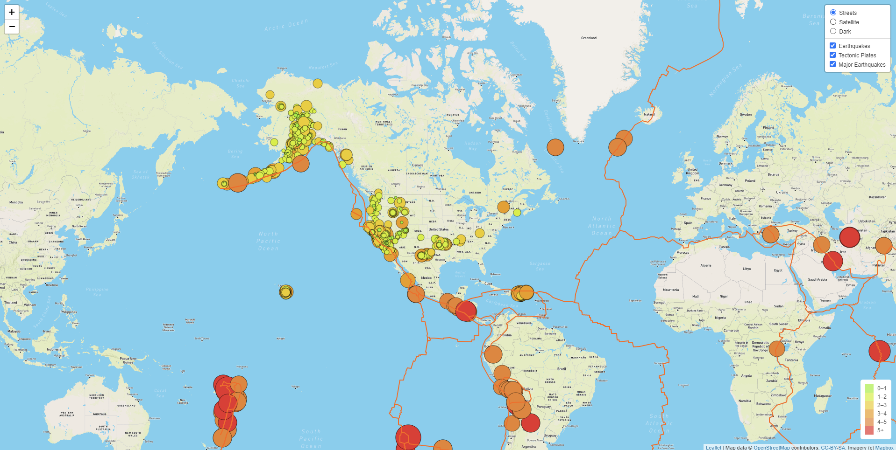
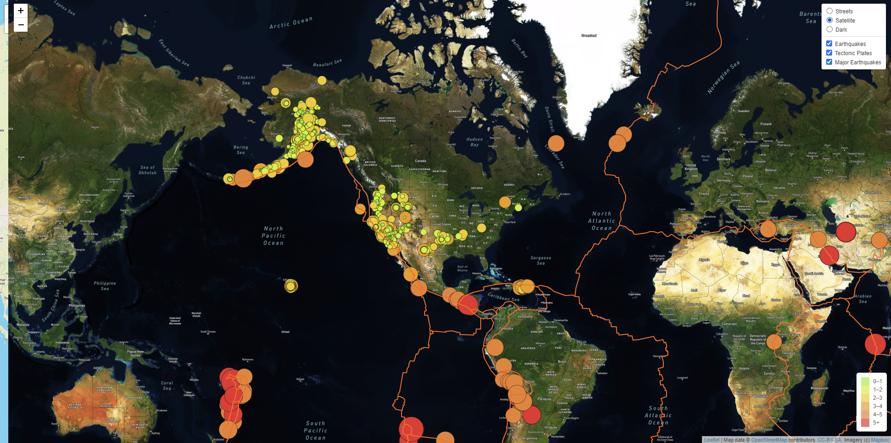
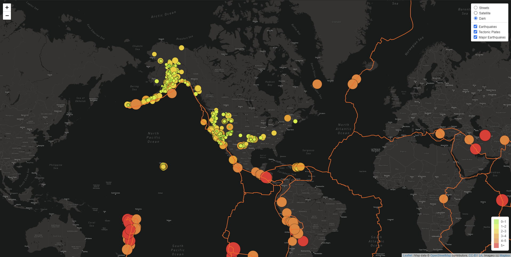

# Mapping_Earthquakes

# Project Background:

One way we can tell stories with data is through interactive maps, which is what we have created in this project for our client to get the better understanding by Visualizing Earthquke Data. We are visually showing the differences between the magnitudes of earthquakes all over the world for the last seven days.

We have use the JavaScript and the D3.js library to retrieve the coordinates and magnitudes of the earthquakes from the GeoJSON data. We have also use the Leaflet library to plot the data on a Mapbox map through an API request and create interactivity for the earthquake data.

# Results:

We displayed the Major Earthquakes and Eathquakes with Tectonic plates and in threee different views, Street, Satellite and dark view.

## Street View

## Satlellite View

## Dark View

